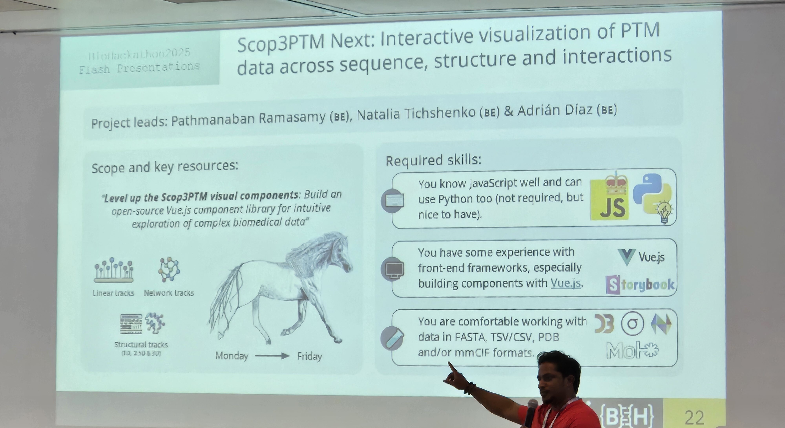
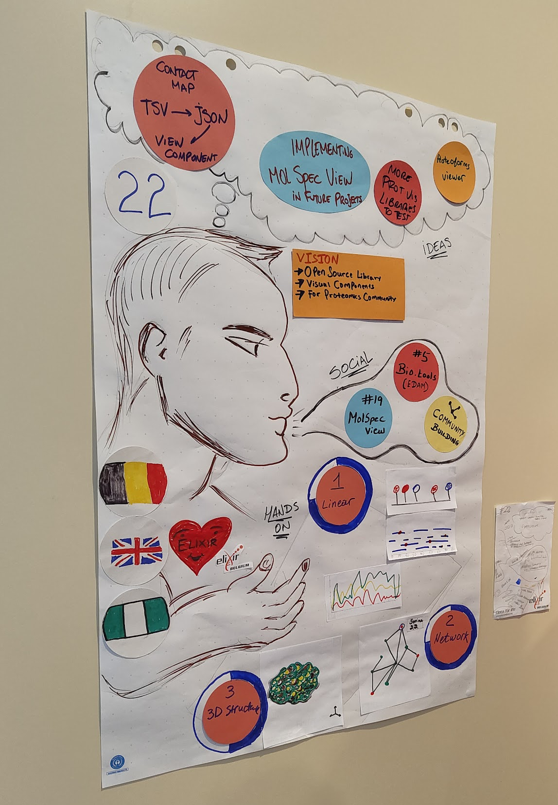
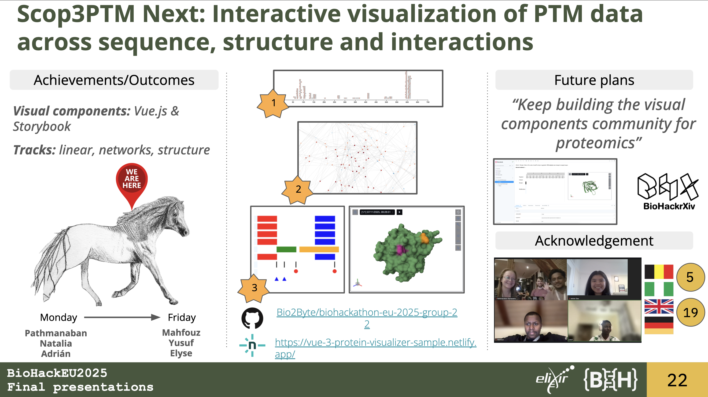

# Background

From Monday, 3 November 2025, to Friday, 7 November 2025, the group 22 conducted a series of technical tasks aimed at improving the visualisation components developed for the Scop3P and Scop3PTM projects. These efforts are referred as Scop3PTM Next.

Scop3P is a comprehensive database of human phosphosites presented within their full biological context. It integrates protein sequences (UniProtKB/Swiss-Prot), structures (PDB) and uniformly reprocessed phosphoproteomics data (PRIDE) to annotate all known human phosphosites [@citesAsAuthority:Scop3P2020]. The resource is available at https://iomics.ugent.be/scop3p.

Scop3P is currently being extended to Scop3PTM, which will provide a unique and powerful resource for understanding the impact of PTM sites on human protein structure–function relationships. While the original Scop3P system integrated 36 projects, 60.2 million processed spectra, and one modification type, the new system will encompass 539 projects, approximately 1 billion processed spectra and more than 117 modification artifacts.

Both Scop3P and Scop3PTM are developed by _CompOmics_, a research group led by **Prof. Dr. Lennart Martens**. This group is part of the Department of Biomolecular Medicine within the Faculty of Medicine and Health Sciences at Ghent University and is affiliated with the VIB-UGent Center for Medical Biotechnology (VIB), both located in Ghent, Belgium.

_CompOmics_ collaborates closely with _Bio2Byte_ lab, a Structural Biology research group based in Brussels and led by **Prof. Dr. Wim Vranken**. _Bio2Byte_ is affiliated with the VIB Structural Biology Research Centre and the Interuniversity Institute of Bioinformatics in Brussels.

For this BioHackathon Europe both laboratories joined forces to co-lead the group 22.

## Team organisation

The group 22 was co-led by: 

- **Pathmanaban Ramasamy** (_CompOmics_): attended in person.
  - Coordinated the tasks, provided example data and offered overall guidance.
- **Natalia Tichshenko** (_CompOmics_): attended in person.
  - Coordinated the tasks, provided example data, contributed to the Linear track.
- **Adrián Díaz** (_Bio2Byte_): attended in person.
  - Coordinated the tasks, contributed to the 3D/Structural track.

During the kick-off meeting on Monday morning, the group outlined the project's objectives and the skills required from participants. The five-day project was divided into three tracks: linear plots, network representations and 3D/structural visualisations.

{ width=250px }

By Tuesday morning, Group 22 had expanded to include new members, both on-site and online:

- **Mahfouz Shehu**: attended in person.
  - Contributed to the Graph track.
- **Yusuf Shehu**: joined remotely from Nigeria.
  - Contributed to the Graph track.
- **Elyse Cheng**: joined remotely from the United Kingdom.
  - Contributed to the 3D/Structural track.


# Goals

The final goal of this project is a two-side pane canvas where one side contains the 3D/Structural view (in general to the right) while the other side contains linear or graphs representations of a given protein. We propose novel visualization ideas focusing on bridging sequence (1D), residue contact maps (2D), Residue Interaction Networks (RINs-2.5D) and protein structures (3D). 

## Technical Stack 

We decided to build the components using the JavaScript programming language, based on the [`Node.js`](https://nodejs.org/en)[@citesAsAuthority:nodejs] runtime environment (LTS version `Jod`, specifically `v22.14.0`). To manage `Node.js` versions, we rely on [`nvm`](https://github.com/nvm-sh/nvm)[@citesAsAuthority:nvm].

The aim of the project was to develop an open-source library of visual components for proteomics projects. As a team requirement, we wanted to keep the implementation simple and as plug-and-play as possible. To meet these requirements, all visual representations were developed as [`Vue.js`](https://vuejs.org/guide/introduction.html) (version 3) components [@citesAsAuthority:vuejs].

With respect to dependencies, the project requires [`D3.js`](https://d3js.org) for the linear and network representations, `Nightingale Elements` [@citesAsAuthority:Nightingale2023] for positional tracks, and `MolStar` [@citesAsAuthority:Molstar2021] for the visualisation and analysis of large-scale molecular data. In particular, we used `MolSpecView` [@citesAsAuthority:molspecview2025] (referred as `MSV`) to generate the 3D views. The inclusion of `MSV` is a great example of new ideas after discussing with other groups during the working week at the venue. We hold several small discussions on the fly with Group 19, "MolViewSpec: A presentation layer for structural molecular data" and they taught how to start using `MSV` for our 3D rendering needs.

Given the goal was to distribute the components as a reusable library, all developments are encapsulated as [`Storybook`](https://storybook.js.org) UI components [@citesAsAuthority:storybook]. This JavaScript framework enables the creation of isolated components and interaction with them without the need to run the entire application.  

To simplify both the development process and the learning curve, we created a [public repository](https://github.com/Bio2Byte/BioHackathon-eu-2025-group-22) containing example files for each track. 

```bash
git clone git@github.com:Bio2Byte/biohackathon-eu-2025-group-22.git
cd biohackathon-eu-2025-group-22
```

This repository includes the setup for all referenced libraries, allowing any user to access and explore the visual component library through the Storybook framework.

```bash
nvm use
npm install
npm run storybook
``` 

The visual library will be available at http://localhost:6006. The left panel is organised into folders corresponding to the different tracks and their respective components. At the bottom, a parameters section allows users to modify the properties of the shown component.

## Tracks

The first track focuses on improving the existing visualizations in Scop3PTM, by refining the 1D feature viewer for PTMs. It includes displaying multiple PTMs on the same residue with biological context (tissue, subcell, disease state) and peptide coverage maps from mass-spectrometry data. Then, the second track is centred on the network representations of the proteins, such as the contact maps. Finally, the third track, enhancing the MolStar viewer, improving 1D-3D linking, and adding biophysical features like ligand binding regions and PTM hot-spots.

### Linear track

This track is centred in 2D plots where the X-axis contains all the positions of a protein sequence. These plots cover multiple representations of positional values in the Y-axis. These plots are generated using the `D3.js` library.

- The *lollipop plot* for displaying positional modifications.  
- The *peptides plot* for showing coverage derived from mass spectrometry data.

Both plots, developed by **Natalia Tichshenko**, are designed to be integrated within a container component called the `stacked view`, which enables shared tooltips and zooming across all stacked plots.

### Network track

This track focuses on node-edge representations as networks. For this BioHackathon, we decided to implement contact maps as the first visual component. This network renders the distances between all pairs of residues within a protein structure.

**Mahfouz Shehu** and **Yusuf Shehu** contributed to this track by converting the provided tabular data (TSV) into a JSON format suitable for network representation (nodes and edges) using the D3.js library. This work is available in the GitHub repository [ygs07/protein-d3-representation](https://github.com/ygs07/protein-d3-representation) and can be integrated into our Storybook visual library via npm (`vue-protein-network-visualizer`). The integration code is available on the branch `2025/november/feature/protein-network-visualisation`. 

### 3D/Structural track

This track focuses on the `Nightingale` linear tracks and the protein's 3D structure. As a starting point, **Pathmanaban Ramasamy** shared a document in `Jupyter Notebook` format (an interactive document written in `Markdown` and `Python` code snippets) that generates a two-panel interface linking positional tracks to the 3D representation of the protein of interest. 

**Elyse Cheng** contributed to this track by converting the Jupyter Notebook code into `Vue.js` (version 3) components corresponding to each `Nightingale` element, while **Adrián Díaz** implemented the `MolSpecView` library to render the 3D structure.

Additionally to the 3D structure, we included the [`Topology viewer`](https://github.com/PDBeurope/pdb-topology-viewer) part of the "PDB Component Library", to show connect the Nightingale tracks to the secondary structure of the protein of interest.

# Social interactions

This project brought together a multidisciplinary team of participants with diverse backgrounds and experiences. It provided an opportunity to work in a hybrid setting, combining both on-site and online participation. The group had members working remotely from the UK and Nigeria.

On Wednesday, the on-site members of the group presented its progress during the "Mid-week reporting poster session & coffee break" held in the main room of the venue. Our poster was designed to visually cover the ideas that emerged from social interactions, the group's shared vision and the progress of the hands-on work of the three different tracks.

{ width=250px }

# Discussion and conclusions

In addition to the technical work, the social interactions played a crucial role in broadening the group's collective understanding of visualisation components, requirements and best practices for providing the proteomics community with relevant tools.  

We hope this BioHackathon Europe project marks the first step towards developing a collaborative suite of visual components that will be of lasting value to the proteomics community. The repository will remain open and under continuous development.  



# Future work

Several tasks remain to be completed. Once these are finished, the _CompOmics_ team will implement the visual components on both the Scop3P and Scop3PTM websites:

1. Install and configure the npm package for the contact map.  
1. Complete the conversion of the Jupyter Notebook's `Nightingale` components into `Vue.js` components.  
1. Add support for overlapping/aligned structures.  
1. Connect click events between both panels of the two-panel interface.

# Jupyter notebooks, GitHub repositories and data repositories

All tasks associated with this BioHackathon project are available in the official public repository hosted on GitHub. The repository contains the visual components, example datasets, and Storybook stories used to preview the components.  

1. Official public repository: [Bio2Byte/BioHackathon-eu-2025-group-22](https://github.com/Bio2Byte/BioHackathon-eu-2025-group-22)  
2. Network repository: [ygs07/protein-d3-representation](https://github.com/ygs07/protein-d3-representation)  
3. Network online demo: [Netlify App](https://vue-3-protein-visualizer-sample.netlify.app/)

# Acknowledgements

We would like to express our gratitude to everyone involved in _BioHackathon Europe 2025_ and to all the coordinators who made it possible. We also thank _ELIXIR Belgium_, _CompOmics_ and _Bio2Byte_ for their constant support and help us to be part of this BioHackathon edition.

Special thanks to Group 22's team members for their contributions throughout the week. The co-leaders of the group hope that everyone learned from and enjoyed the experience, whether participating in person or remotely.

Finally, we extend our appreciation to the staff of the _Hotel Esplanade Resort & Spa_ for their hospitality and excellent service during our stay at the venue.

# References
