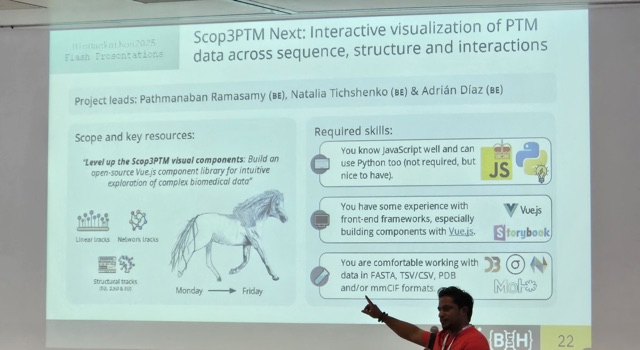
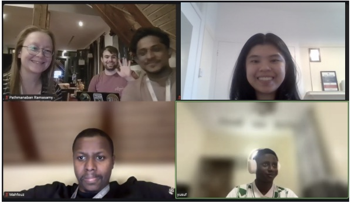
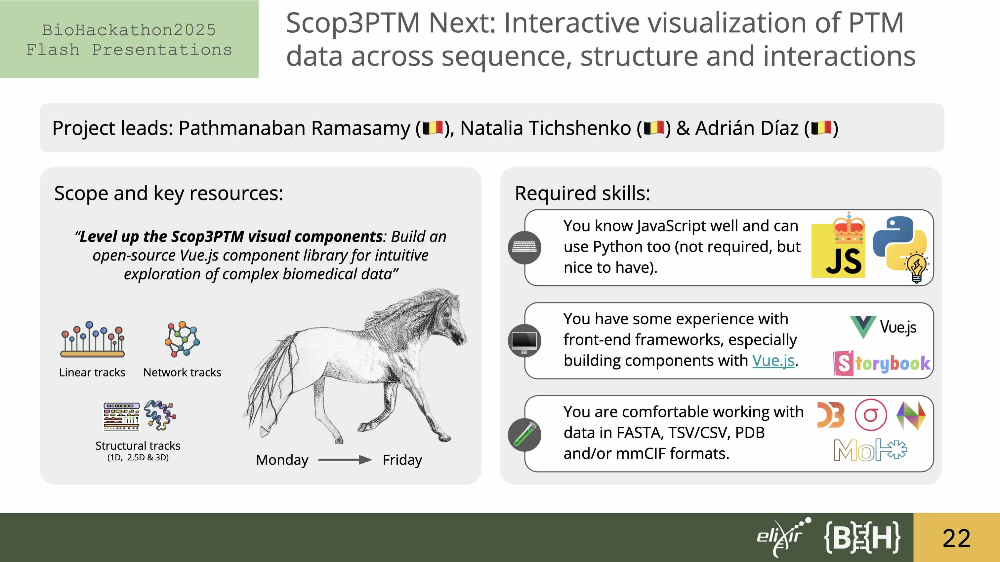
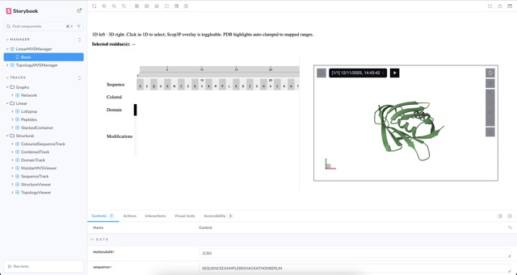
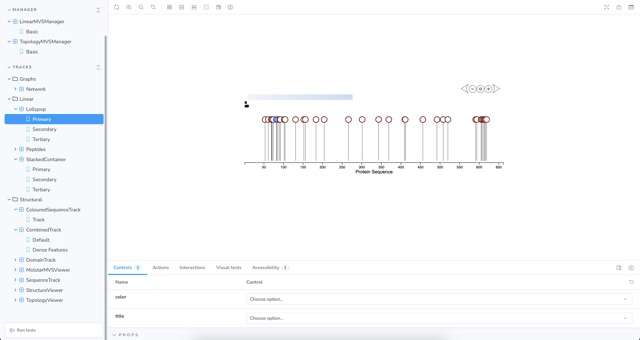
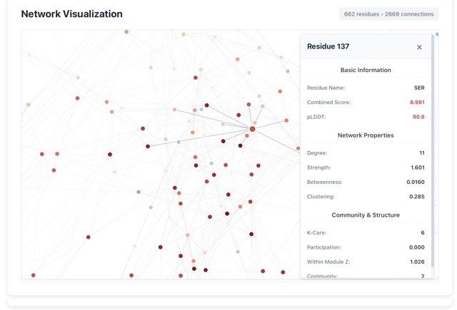
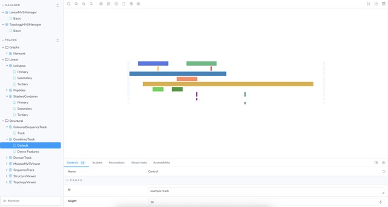
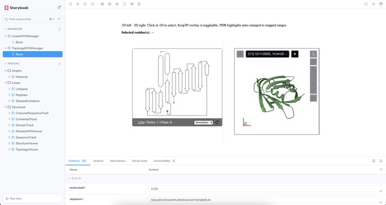
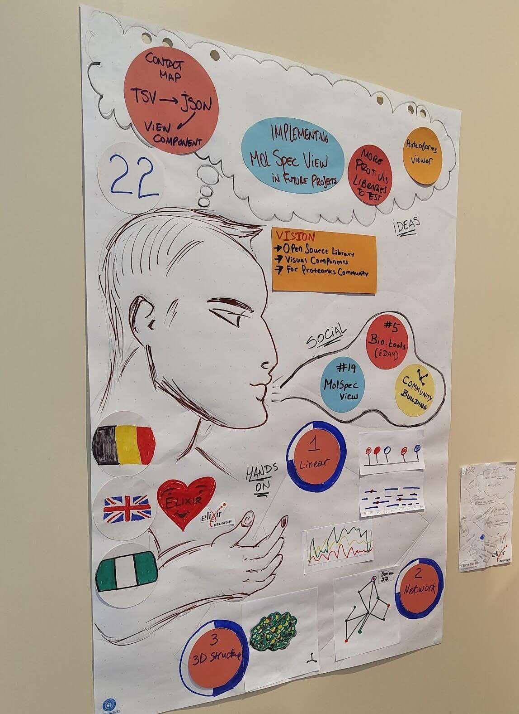

# Background

The rapid growth of large-scale proteomics has created an urgent need for intuitive and reliable tools that allow researchers to explore post-translational modifications (PTMs) across multiple biological contexts. PTMs influence proteins at different spatial and functional scales, from residue-level sequence features to changes in three-dimensional structure, conformational ensembles, and residue–residue interaction networks. Navigating this complexity requires visual frameworks that can seamlessly connect 1D sequence annotations, 2D contact or network views, 2.5D residue interaction networks, and 3D structural information. However, such an integrated system is still lacking in current bioinformatics resources.

_Scop3P_ was developed to address this need for phosphorylation, providing the first platform to combine curated protein sequences (UniProtKB/Swiss-Prot), experimentally determined protein structures (PDB), predicted protein structures (AlphaFold) and uniformly reprocessed phosphoproteomics data from PRIDE to annotate all known human phosphosites [@citesAsAuthority:Scop3P2020]. The resource is publicly available at [https://iomics.ugent.be/scop3p](https://iomics.ugent.be/scop3p).

_Scop3P_ is now being expanded into _Scop3PTM_, a next-generation resource that incorporates hundreds of PTM types. While the initial system integrated 36 PRIDE projects, 60.2 million processed spectra, and a single modification type, _Scop3PTM_ will encompass 500+ projects, approximately 1 billion processed spectra, and more than 117 biological and 200+ non-biological modification types. This expansion aims to support a unified and biologically meaningful analysis of PTM-mediated effects on protein structure and function across the human proteome.

Despite the richness of PTM evidence, the increasing depth and heterogeneity of the data present a major visualisation challenge. Researchers require tools capable of displaying multiple PTMs on the same residue, linking PTM occurrence to tissue, subcellular, or disease contexts, visualising mass-spectrometry peptide coverage, examining contact maps or residue interaction networks, and tracing PTM-induced changes in protein structure in 3D. Existing tools address isolated aspects of this problem, but none provide a coherent, reusable, and modular framework for integrated PTM exploration.

To address this gap, _Scop3PTM Next_ was initiated during BioHackathon Europe 2025. The project focuses on creating an open-source, extensible library of JavaScript components that unify 1D, 2D, 2.5D, and 3D protein visualisations. Built using `Vue.js` and documented through `Storybook`, the library includes linear tracks, peptide coverage maps, network-based plots, and structural views powered by `Mol*` and `MolSpecView`. The overarching goal of _Scop3PTM Next_ is to establish a shared visual foundation that can be adopted not only within _Scop3P_ and _Scop3PTM_, but also across the broader proteomics and structural biology communities.

## Team organization

Project 22, titled _Scop3PTM Next_, was carried out during BioHackathon Europe from 3 to 7 November 2025. The initiative brought together members of the [_CompOmics_](http://compomics.com) and [_Bio2Byte_](https://bio2byte.be) laboratories, two research groups with complementary expertise in proteomics, structural biology, and interactive data visualization.

_CompOmics_, led by Prof. Dr. Lennart Martens, is based within the [Department of Biomolecular Medicine](https://www.ugent.be/ge/biomolecular-medicine/en) at Ghent University and affiliated with the [VIB–UGent Center for Medical Biotechnology](https://cmb.sites.vib.be/en). The group develops computational tools and scalable data resources for proteomics and PTM analysis, and maintains both _Scop3P_ and the forthcoming _Scop3PTM_ frameworks.

_Bio2Byte_, led by Prof. Dr. Wim Vranken, is a structural biology research group based at the [VIB Structural Biology Research Centre](https://www.vubtechtransfer.be/structural-biology) and the [Interuniversity Institute of Bioinformatics in Brussels (IB2)](http://ibsquare.be). The laboratory focuses on protein structure analysis, macromolecular interactions, and the development of structural and biophysical data visualization tools.

For this edition of BioHackathon Europe, the two laboratories co-led Project 22 and guided a hybrid team of on-site and remote participants. This collaboration brought together expertise in proteomics, structural biology and software development, enabling coordinated progress across all visualization tracks.

The project began with a kick-off meeting on Monday morning, during which the group clarified the project objectives, outlined the required skills, and divided the work into three main tracks: linear visualizations, network representations, and structural visualizations.

The project was co-led by:

- **Pathmanaban Ramasamy** (_CompOmics_) — attended in person; coordinated tasks across all tracks and provided example data files and a Jupyter Notebook for the structural track.
- **Natalia Tichshenko** (_CompOmics_) — attended in person; coordinated tasks across all tracks, provided example data files, and contributed to the development of the linear track.
- **Adrián Díaz** (_Bio2Byte_) — attended in person; coordinated the overall development, provided example files, and contributed to the structural track.

{ width=350px }

By Tuesday morning, Project 22 had grown into a six-member team, with one member attending in person and the others participating remotely via the project's Zoom breakout room:

- **Mahfouz Shehu** — attended in person; contributed to the network track development.
- **Yusuf Shehu** — joined remotely from Nigeria; contributed to the network track development.
- **Elyse Cheng** — joined remotely from the United Kingdom; contributed to the structural track by converting Jupyter Notebook logic into _Vue.js_ components.



The group held an internal kick-off meeting on Tuesday, followed by track-specific discussions focusing on the technical requirements of each visualization component. Additional daily meetings were organized throughout the week to monitor progress, synchronize contributions across tracks, and ensure smooth collaboration between on-site and remote participants.

# Goals

The central objective of _Scop3PTM Next_ was to design and implement an extensible visual framework capable of linking protein sequence features, residue–residue interactions, and structural information within a unified, interactive interface. The envisioned system consists of a two-panel layout in which linear or network-based representations of a protein are displayed alongside a corresponding three-dimensional structural view. This configuration allows users to explore PTMs, structural features and interaction patterns seamlessly across 1D, 2D, 2.5D and 3D representations.



The project set out to develop a collection of modular JavaScript components that could be reused within _Scop3P_, _Scop3PTM_, and other proteomics resources. Each component was designed as an isolated _Vue.js_ module and documented through the _Storybook_ framework to ensure reproducibility, accessibility, and ease of integration.

Three major visualization domains were defined:

1. linear tracks capturing sequence-level information such as PTMs and peptide coverage,
2. network representations focusing on residue–residue relationships derived from structural data, and
3. structural views using _Mol*_ and _MolSpecView_ to visualize protein conformations and link sequence features to atomic coordinates.

By the end of the hackathon, the aim was to deliver a working suite of prototype components spanning these three domains, together forming the basis for a consistent and reusable visual library for PTM exploration.


## Technical stack

The development of the _Scop3PTM Next_ visualization library was carried out using a modern, modular JavaScript ecosystem designed to support flexibility, reusability, and ease of integration across proteomics resources. All components were implemented in JavaScript and executed using the [`Node.js`](https://nodejs.org/en) runtime environment (LTS release `Jod`, version `v22.14.0`). To ensure reproducibility, the team relied on [`nvm`](https://github.com/nvm-sh/nvm) for managing Node.js versions throughout the project environment.

The core visual elements were implemented as reusable components in [`Vue.js`](https://vuejs.org/guide/introduction.html) (version 3). This framework was selected for its clear component architecture, lightweight footprint, and compatibility with the existing front-end infrastructure planned for _Scop3PTM_. Each visual component was encapsulated as an isolated unit to allow straightforward integration into other applications or pipelines.

A number of specialized libraries were employed to support the different representation layers required for PTM visualization. Linear plots and protein-position tracks were implemented using `D3.js` for custom SVG-based rendering and `Nightingale Elements` [@citesAsAuthority:Nightingale2023] for structured positional tracks. For three-dimensional structural visualization, the project adopted `Mol*` [@citesAsAuthority:Molstar2021] and, following discussions with Group 19 during the hackathon, incorporated the `MolSpecView` library [@citesAsAuthority:molspecview2025] (referred to as `MSV`) to enhance interactive structural rendering.

Given the goal of building a reusable and community-friendly library, all components were developed within the [`Storybook`](https://storybook.js.org) environment [@citesAsAuthority:storybook]. Storybook enabled the team to document each component in isolation, preview functionality without requiring a full application, and simplify adoption for future developers.

A public repository was created at the beginning of the project to provide examples and template code for each visualization track:

```bash
# Clone the repository to create a local copy in your environment
git clone git@github.com:Bio2Byte/biohackathon-eu-2025-group-22.git

# Navigate to the repository directory
cd biohackathon-eu-2025-group-22
```

The repository includes pre-configured examples for _Vue.js_, `D3.js`, `Nightingale`, `Mol*`, and `MolSpecView`, allowing contributors and future users to explore the component library immediately. Once dependencies were installed through `npm`, the Storybook interface could be launched locally using:

```bash
# Set up the project's Node.js version as defined in the .nvmrc file (v22.14.0)
nvm use

# Install the npm dependencies
npm install

# Start the Storybook server
npm run storybook
```

This environment provides access to the full visual component library at `http://localhost:6006`, where the left panel exposes the component hierarchy and the lower section offers configurable parameters for interactive testing.

{ width=250px }

## Tracks

The development work undertaken during _Scop3PTM Next_ was organized into three complementary visualization tracks: linear sequence-based views, network representations derived from structural contacts, and three-dimensional structural visualizations. Each track contributed a distinct layer to the overarching goal of creating an integrated and reusable component library capable of linking 1D, 2D and 3D representations of protein features and PTMs.

### Linear track

The linear track focused on enhancing 1D visual representations of protein sequences, with particular emphasis on displaying PTMs, peptide coverage and other residue-level annotations. These visualizations were implemented as scalable two-dimensional plots in which the x-axis corresponds to sequence position, while the y-axis is used to display positional features or quantitative values. All plots were constructed using the `D3.js` library to enable custom SVG-based rendering and fine-grained interactive behavior.

Two core components were developed as part of this track. The first is a *lollipop plot* designed to visualize PTMs and other positional modifications as interactive markers along the sequence. The second is a *peptide coverage plot* capable of showing the regions supported by mass-spectrometry evidence. Both components were implemented by **Natalia Tichshenko** and were designed to function within a shared container component known as the `stacked view`, which enables unified tooltips, coordinated highlighting and zooming across multiple linear plots displayed together.



### Network track

The network track addressed the need for two-dimensional contact or interaction maps that capture the relationships between residues within a protein structure. The initial focus of the track was the construction of contact maps rendered as node–edge networks, where nodes represent amino acid residues and edges encode distance-based interactions derived from structural data.

For this purpose, **Mahfouz Shehu** and **Yusuf Shehu** transformed the provided tabular contact-map data (TSV format) into a JSON schema suitable for visualisation using `D3.js`. Their implementation, available in the GitHub repository [ygs07/protein-d3-representation](https://github.com/ygs07/protein-d3-representation), supports both graph construction and interactive rendering. The visualizer can be incorporated into the _Scop3PTM Next_ Storybook environment through the npm package `vue-protein-network-visualizer`, with integration code maintained on the branch `2025/november/feature/protein-network-visualisation`.



### Structural track

The structural track integrated one-dimensional positional annotations with interactive three-dimensional molecular views. The starting point for this work was a Jupyter Notebook template prepared by **Pathmanaban Ramasamy**, which demonstrated how Nightingale tracks could be linked to a 3D representation of a protein using _Mol*_.

Building on this foundation, **Elyse Cheng** translated each Nightingale element used in the notebook into a standalone `Vue.js` (version 3) component, enabling these tracks to be rendered directly within the component library. In parallel, **Adrián Díaz** implemented support for the `MolSpecView` (`MSV`) library to provide high-quality, interactive 3D structural rendering and to enable coordinated interactions between sequence features and structural coordinates.



To complement the 3D viewer, the track also incorporated the [`Topology viewer`](https://github.com/PDBeurope/pdb-topology-viewer), part of the PDBe Component Library. This tool provides a 2D abstraction of secondary structure architecture, allowing users to relate linear features displayed in Nightingale tracks to the underlying folds and domains of the protein.




# Social interactions

The project brought together a multidisciplinary team with diverse backgrounds in proteomics, structural biology and software development. One of the defining aspects of _Scop3PTM Next_ was its hybrid format, combining on-site collaboration with active participation from remote contributors joining from the United Kingdom and Nigeria. This structure enabled continuous exchange of ideas and fostered an inclusive environment where technical discussions and design decisions benefited from multiple perspectives.

Midway through the hackathon, the on-site participants presented the group’s progress during the “Mid-week reporting poster session & coffee break” held in the venue’s main hall. The hand-drawn poster summarized the conceptual direction of the project, visualization ideas inspired by informal discussions, and the progress achieved across the linear, network and structural tracks.

{ width=250px }

# Discussion and conclusions

Alongside the technical development, the social interactions throughout the week played a central role in shaping the project. Conversations during breaks, ad-hoc discussions with members of other groups and shared problem-solving sessions contributed to refining the requirements and implementation strategies for the visualization components. These exchanges helped the team converge on best practices for designing tools that serve the needs of the proteomics community.

The work completed during BioHackathon Europe represents the foundation of a collaborative, extensible suite of visual components that will support the growing scale and complexity of PTM data. The _Scop3PTM Next_ repository will remain open and continue to evolve as new features, components and community contributions are integrated.

{ width=250px }

# Future work

Several tasks remain to be completed before full integration of the visualization components into the _Scop3P_ and _Scop3PTM_ platforms. These include:

1. Installing and configuring the npm package for the contact map component.
2. Completing the translation of the Jupyter Notebook’s `Nightingale` elements into standalone `Vue.js` components.
3. Adding support for overlapping and structurally aligned models within the 3D viewer.
4. Implementing coordinated click events between the linear, networks and structural panels in the multi-panel interface.

These steps will enable the seamless incorporation of the newly developed components into production environments and ensure a robust foundation for future extensions.

# Collaborations

Throughout the hackathon, the _Scop3PTM Next_ team engaged in several productive discussions with other project groups whose objectives intersected with our own. Notably, the leads met with **Project 19** ("MolViewSpec: A presentation layer for structural molecular data"), whose work on structural visualization aligns closely with our goals. These exchanges explored opportunities for harmonizing component design and avoiding unnecessary duplication of functionality, with the shared aim of advancing proteoform visualization in a coordinated manner.

The team also interacted with **Project 5**, which focuses on overcoming barriers to sustainable software metadata management and enhancing FAIR practices by embedding curation within existing development workflows. These discussions highlighted clear pathways for strengthening the FAIR-ification of _Scop3P_ and _Scop3PTM_. As part of this effort, steps were initiated to register the project’s resources within the **bio.tools** registry, ensuring improved visibility, discoverability and long-term maintenance.

# Data and code availability

All materials developed during this BioHackathon project are publicly accessible through the project’s GitHub repositories. These resources include the visual components, example datasets, Jupyter notebooks and Storybook environments used for demonstrating and testing the _Scop3PTM Next_ visualization framework.

1. Project #22 description on the [elixir-europe/biohackathon-projects-2025](https://github.com/elixir-europe/biohackathon-projects-2025) repository:  
   [Group 22](https://github.com/elixir-europe/biohackathon-projects-2025/blob/364145ab8d705846ef3c1d32ecdb091ea1153ec7/22.md)
2. Main public repository containing all components and examples:  
   [Bio2Byte/BioHackathon-eu-2025-group-22](https://github.com/Bio2Byte/BioHackathon-eu-2025-group-22)
3. Network visualization repository (contact-map network implementation):  
   [ygs07/protein-d3-representation](https://github.com/ygs07/protein-d3-representation)
4. Online demo of the network viewer:  
   [Netlify App](https://vue-3-protein-visualizer-sample.netlify.app/)

All code is released openly for reuse and further development by the proteomics and structural biology communities.

# Acknowledgements

We would like to express our sincere gratitude to all contributors and organizers of _BioHackathon Europe 2025_, whose efforts made this collaborative project possible. We especially acknowledge the support of _ELIXIR Belgium_, _CompOmics_ and _Bio2Byte_ for providing the organizational framework, technical resources and scientific guidance that enabled the development of _Scop3PTM Next_.

Special thanks go to the members of Project #22: Mahfouz, Yusuf and Elyse for their dedicated contributions across the linear, network and structural tracks. The co-leads deeply appreciate the enthusiasm and commitment shown by both on-site and remote participants, whose combined efforts shaped the outcomes of the project.

We also extend our appreciation to the staff of the _Hotel Esplanade Resort & Spa_ for their warm hospitality and excellent support throughout the duration of the hackathon.

# References
